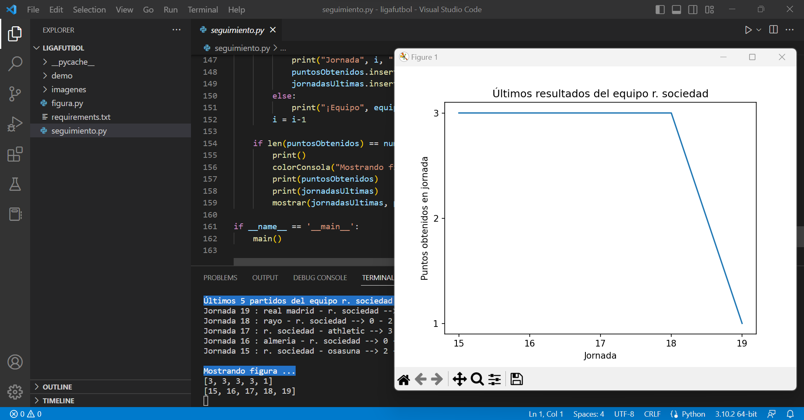
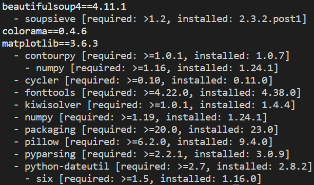

# ligafutbol

Web scraping of the Spanish football league

## Application context

On the one hand, the Spanish football league system consists of several professional, semi-professional and non-professional leagues bound together hierarchically by promotion and relegation. The top two tiers of the male league pyramid are First and Second Divisions. On the other hand, Web scraping is data scraping used for extracting data from websites.

For this application, we will obtain the results of matches played using the MARCA.com website and analyse them. For example, this analysis could be used while you do La Quiniela. La Quiniela is a game of chance that focuses on betting on the possible outcome of any First and Second Division football match (generally).



## Instructions

This application is written in Python. It uses Beautiful Soup that is a Python package for parsing HTML and XML documents, which is useful for Web scraping.

## Usage

Install a Python interpreter.

Download the files as a zip using the green button, or clone the repository to your machine using Git.

Uncompress .zip file and type:

```
cd <uncompressed folder>
```

2 options:

1. Usage (normal)

Install dependencies.



```
pip install -r requirements.txt
```

Execute [seguimiento.py](seguimiento.py) Python file.

```
python seguimiento.py
```

2. Usage (virtually)

Install pipenv package.

```
pip install pipenv
```

Install dependencies.


```
pipenv install -r requirements.txt
```

Execute [seguimiento.py](seguimiento.py) Python file with pipenv.

```
pipenv run python seguimiento.py
```

Remove the current virtual environment.

```
pipenv --rm
```

Remove Pipfile Pipfile.lock files.

## Note

The source code is written in Spanish because of the potential users who have the application.

## Demo


## References

[Beautiful 23] Crummy. "Beautiful Soup Documentation". February 2023.
Available at: https://www.crummy.com/software/BeautifulSoup/bs4/doc/

[Python 23] Python. "Download the latest version". February 2023.
Available at: https://www.python.org/downloads/
